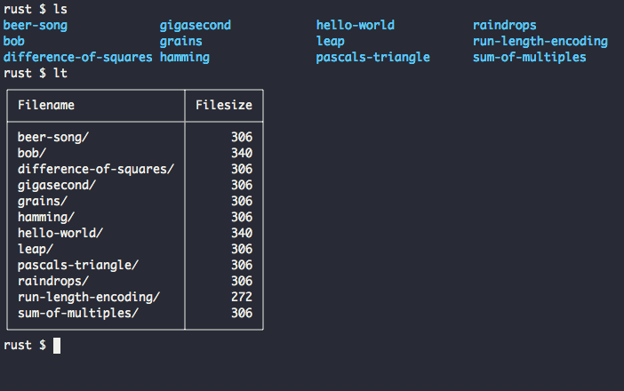

# lt
## Tabular file listing for your terminal

### What is it?
It displays your files like `ls`, but in a table.

### Why?
I wanted an easy project to work with Rust.  Plus, this is something I'd use regularly.  

### Installation
For now, build from source by cloning the repo and running `cargo install`.

### Usage
Simply `lt` from your terminal.

#### Options
- `-p, --pattern '<pattern>'` will only show files that match the specified glob pattern.  Eg: `lt -p '*.rs'`.
- `-a, --all` will show dotfiles.  Analogous to `ls -a`.

### Screenshots

### Todo
- [ ] Add sorting options via flags
- [ ] Ensure the terminal is wide enough before showing the table
- [ ] Refactor loops

### License
[MIT](https://github.com/kieraneglin/lt/blob/master/LICENSE)
